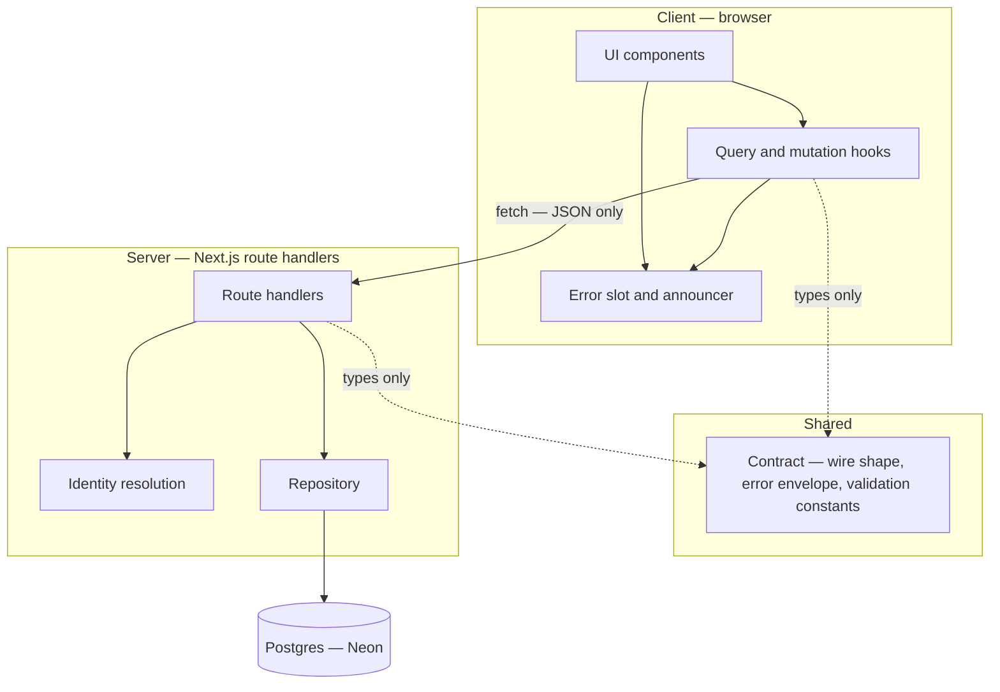
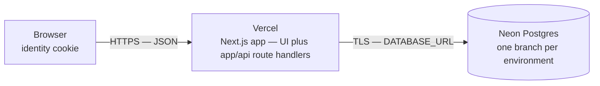
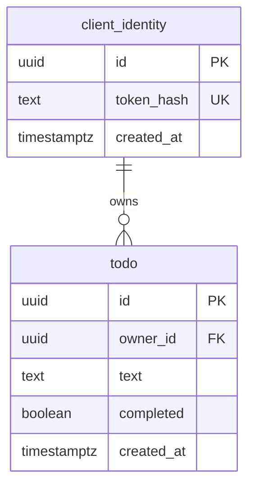

# Architecture Spine — Simple Action

## Design Paradigm

**Layered, with exactly one crossing.**

UI components → TanStack Query hooks → `fetch` → route handler → repository → Drizzle → Postgres.

The HTTP contract is the only crossing between the client layers and the server layers. One shared module is the only code both sides import; everything else on one side is invisible to the other. Layers map to directories one-to-one (see *Structural Seed*), and the dependency graph under *Invariants & Rules* is the enforceable form of this paradigm.

The product runs as **one deployable**. That makes the client/server boundary a convention rather than a wall, and AD-1 through AD-3 are what buy the wall back.

## Invariants & Rules



No arrow may be added to this graph without a new AD. In particular: no UI component calls `fetch`, no route handler imports Drizzle, and nothing on the server imports from `src/client`.

### AD-1 — Route handlers are the only server entry point

- **Binds:** all client–server communication
- **Prevents:** one story implementing a mutation as a Next.js Server Action and another as `fetch`; both are idiomatic, and together they are two APIs with two error models.
- **Rule:** every client–server interaction goes through a REST route handler under `app/api/`. Server Actions are not used anywhere in this codebase.

### AD-2 — The repository is the only code that touches the database

- **Binds:** all server code; the PRD §5 extensibility NFR
- **Prevents:** data access spreading across route handlers, leaving no single place a future ownership or authentication check can clamp onto.
- **Rule:** only modules under `src/server/repository/` may import the Drizzle client. Route handlers call repository functions and never build queries. Every repository function takes `ownerId` as its first parameter, so scoping a read or write to its owner is structural rather than remembered.

### AD-3 — One shared contract module defines the wire shape

- **Binds:** all client–server communication; FR-1 through FR-6
- **Prevents:** a server response and a client expectation drifting apart story by story, each side describing a Todo in its own words.
- **Rule:** `src/shared/contract/` is the single definition of the Todo JSON shape, the error envelope, and the validation constants. Route handlers and client hooks both import it. Neither side declares its own Todo type, and no type is duplicated across the crossing.

### AD-4 — The client generates the Todo id, and create is idempotent

- **Binds:** FR-1, FR-2
- **Prevents:** an optimistic row and an arriving list row being unmatchable by id, forcing a text-match heuristic that breaks the moment two Todos share text — and a retried create producing a duplicate.
- **Rule:** the client mints a UUIDv7 and sends it in the create request body. The server validates it is a well-formed UUIDv7 and never generates one. On primary-key conflict the server compares the existing row's owner: same owner returns the existing row with `200` (an idempotent retry); different owner returns `409` and discloses nothing about the row. This is what makes `EXPERIENCE.md`'s merge-by-id rule literally true and its "never dropped and never duplicated" guarantee enforceable.

### AD-5 — Ordering is `id DESC`; `created_at` is display metadata

- **Binds:** FR-1, FR-2
- **Prevents:** the list re-sorting when an optimistic row reconciles with its server record, and the pin-to-top special case that a server-timestamp sort key would require.
- **Rule:** every list read and every render orders by `id DESC`. Because a UUIDv7 is time-ordered, an optimistic row's sort position is final from the moment it is minted. `created_at` is set by the server (FR-1) and is never a sort key. Todo ids are minted through a single monotonic generator instance so two creates in the same millisecond still order correctly.

### AD-6 — Mutations set state; every endpoint is idempotent

- **Binds:** FR-3, FR-5
- **Prevents:** a retried toggle flipping twice, and a retried delete failing because the row is already gone.
- **Rule:** `PATCH /api/todos/:id` takes `{ "completed": boolean }` and sets that value. There is no toggle endpoint and no endpoint whose result depends on the current state. `DELETE /api/todos/:id` returns `204` whether or not the row was present, provided the caller owns it. Forced by `EXPERIENCE.md`: Retry re-attempts *"setting that Todo to the Completion Status the user asked for, not a fresh toggle of whatever it is now."*

### AD-7 — Client Identity is a cookie-borne opaque token, hashed at rest, and Todos key on the indirection

- **Binds:** FR-6; the PRD §5 extensibility NFR
- **Prevents:** the token being treated as authentication, and Todos keyed directly on the token — which would make attaching real accounts a data migration instead of a column.
- **Rule:** the token is a 256-bit random value, set in an `HttpOnly`, `Secure`, `SameSite=Lax` cookie with a long `Max-Age`, minted only where AD-17 says. Only the SHA-256 hash of the token is stored, in `client_identity.token_hash`. `todo.owner_id` references `client_identity.id` and never the token. The token authorizes nothing beyond its own Todo List and must never be used as, or extended into, authentication. Adding accounts later is a nullable `user_id` on `client_identity`; nothing else moves.

### AD-8 — TanStack Query owns all server state and all optimistic mutation

- **Binds:** FR-1, FR-2, FR-3, FR-5; PRD §5 perceived-responsiveness NFR
- **Prevents:** three optimistic mutations implemented three different ways, each with its own ad-hoc rollback — and, more subtly, one mutation's rollback silently undoing another's optimistic change.
- **Rule:** there is exactly one query key, `['todos']`. Every mutation applies its optimistic change via `setQueryData` and, on error, **reverses only the entity it changed** — remove the row it inserted, restore that one row's previous `completed` value, re-insert that one row at its `id DESC` position. Rollback by restoring a whole-list snapshot is forbidden: with concurrent mutations it undoes changes the failing mutation never made. No server-derived data is ever held in `useState`. Client-only state — Filter View, dialog open, character count — is React state and never enters the query cache.

### AD-9 — One error slot, holding a retry closure

- **Binds:** FR-1, FR-2, FR-3, FR-5; PRD §5 error-handling NFR
- **Prevents:** each mutation owning its own error state, producing two banners at once or a Retry that re-attempts the wrong operation.
- **Rule:** a single slot holds `{ kind, retry } | null`. The failing mutation supplies the `retry` closure, capturing exactly the operation that failed and its arguments. A newer error replaces an older one and the replaced operation is not retried. When the closure's target no longer exists, invoking it is a no-op that clears the slot. This is what makes `EXPERIENCE.md`'s four distinct Retry behaviours a property of the closure rather than four special cases.

### AD-10 — One error envelope; four error kinds

- **Binds:** all failure paths
- **Prevents:** each story inventing its own error shape, leaving the single banner unable to classify a failure into the kind whose Retry semantics it needs.
- **Rule:** every non-2xx response body is `{ "error": { "kind", "message" } }` with `kind` one of `load`, `create`, `update`, `delete`. A transport failure is classified by the operation attempted, not by the response. The client maps `kind` to the user-facing string from `EXPERIENCE.md` §Voice and Tone — `load` and `create` have their own strings, `update` and `delete` share one — and never composes or forwards a server message to the interface.

### AD-11 — Validation is defined once and enforced twice

- **Binds:** FR-1
- **Prevents:** client and server disagreeing on what a valid Todo is, so text the input accepted is rejected by the API.
- **Rule:** trim; reject empty-after-trim; cap at 500 characters. The constants and the predicate live in `src/shared/contract/` and are imported, never retyped. The client enforces them at entry — a hard stop at 500 keystrokes, a silent no-op on whitespace-only submit, no error state either way. The server re-enforces them as a trust boundary and returns error kind `create` on violation.

### AD-12 — One live region, one announcer

- **Binds:** `EXPERIENCE.md` §Accessibility Floor; SM-3
- **Prevents:** each feature mounting its own `aria-live` element, producing duplicate, colliding, or silently dropped announcements.
- **Rule:** exactly one polite live region and one assertive live region are mounted at the app root. Components announce by calling a single `announce(message, urgency)` function. No component renders its own `aria-live` attribute. Errors announce assertively; every other announcement is polite.

### AD-13 — The design tokens are transcribed exactly once

- **Binds:** all UI
- **Prevents:** hex values scattered through components and drifting from `DESIGN.md`, which is the authority on every one of them.
- **Rule:** `DESIGN.md`'s frontmatter is transcribed into the Tailwind v4 `@theme` block in `app/globals.css` and nowhere else. No hex literal and no arbitrary-value class appears anywhere else in the codebase. A value not present in `@theme` must be added there — with its `DESIGN.md` token name — before it can be used.

### AD-14 — Schema changes ship as committed migration files

- **Binds:** all environments
- **Prevents:** the production schema diverging from the repository because someone applied a change from their laptop.
- **Rule:** `drizzle-kit generate` produces SQL migration files that are committed to the repository, and the deploy step applies them. `drizzle-kit push` is local-only and never targets preview or production.

### AD-15 — Deletion is permanent

- **Binds:** FR-5
- **Prevents:** half the codebase filtering on a `deleted_at` column while the other half does not.
- **Rule:** `DELETE` removes the row. There is no soft-delete column and no query filters on deletion state. If PRD §9 Open Question 1 resolves toward an undo affordance, that is a schema addition governed by a new AD, not an assumption to build against now.

### AD-16 — The list load merges by id; a create never cancels it

- **Binds:** FR-1, FR-2; `EXPERIENCE.md`'s add-during-load race
- **Prevents:** the standard optimistic-update recipe silently deleting a Todo. The usual `onMutate` step cancels in-flight queries — but `EXPERIENCE.md` requires the opposite here: the skeletons keep pulsing, the list still arrives, and it *merges* with the optimistic row. Cancel the load and the list never lands; let it land unmerged and it overwrites the cache and the new Todo disappears.
- **Rule:** a create must not cancel the list query. The list response is **merged into the cache by id** — server rows take their place, an unconfirmed optimistic row whose id is absent is kept, and an id present in both collapses to one entry carrying the server record. A list response never wholesale-replaces cache entries while an unconfirmed create exists. Toggle and delete *may* cancel in-flight reads, because they act on rows the server already knows about.

### AD-17 — The Client Identity is issued on the document request

- **Binds:** FR-6; FR-1 during first visit
- **Prevents:** a first-ever visitor being issued two identities. `EXPERIENCE.md` makes the input live before the list arrives, so on a first visit a `GET` and a `POST` can both be in flight with no cookie yet — each mints its own identity, and the new Todo lands in a different Todo List from the one being read.
- **Rule:** Next.js middleware issues the identity cookie on the **document** request, before any API call is possible. Route handlers read the identity and never mint one; a request arriving without a valid identity returns `401` rather than creating one. No API route is an identity-issuing path.

## Consistency Conventions

| Concern | Convention |
| --- | --- |
| Domain vocabulary | The PRD §3 glossary, verbatim, in code as well as copy: `Todo`, `TodoList`, `completed`, `Active`, `Completed`, `ClientIdentity`, `FilterView`. Never `Done`, `task`, `item`, `isDone`, or `status`. The Todo's text column is named `text`, matching the glossary. |
| File and symbol naming | Files and directories kebab-case. React components PascalCase, one per file. Hooks `useX`. Repository functions verb-first and owner-scoped: `listTodos(ownerId)`, `createTodo(ownerId, todo)`. |
| Ids | UUIDv7, lowercase canonical string form, on the wire and in the database. Minted client-side for Todos (AD-4); server-side for `client_identity`. |
| Dates | `timestamptz` in Postgres, ISO-8601 UTC strings on the wire. Server-set only; the client never sends a timestamp. |
| JSON and SQL casing | `camelCase` on the wire, `snake_case` in the database. Drizzle's schema owns the mapping; no other module translates between them. |
| Error shape | `{ error: { kind, message } }`, `kind` in `load` \| `create` \| `update` \| `delete` (AD-10). Success responses are the bare resource or a bare array — no envelope. |
| State ownership | Server state in TanStack Query only (AD-8). Client-only state in React state. Errors through the single slot (AD-9). Announcements through the single announcer (AD-12). |
| Configuration | Environment variables only. `DATABASE_URL` is the sole required secret — the identity token is random and stored hashed, so there is no signing key to manage. No config file holds a secret, and no secret has a committed default. |
| Logging | Server-side `console` via the platform's log drain; no logging library, and no Todo text in any log line. |
| Types | TypeScript `strict: true`. No `any` in `src/shared/contract/`. |
| Motion | Every duration in `EXPERIENCE.md` — the ~400ms hold, the ~180ms collapse, the ~600ms nudge, the skeleton pulse — is a named constant in one motion module, and `prefers-reduced-motion` is honoured in that one place. No component reads the media query itself or inlines a duration. |
| Completed-row styling | The mint step-down (`accent-deep` for the checked checkbox and focus ring on a Completed row) is expressed once: the row sets a single variant marker and every descendant derives from it. No component re-tests Completion Status to pick a colour. |
| Fonts | Poppins is loaded through `next/font` with the `DESIGN.md` fallback stack, so the metric-adjusted fallback prevents the layout shift that `DESIGN.md`'s zero-shift skeleton requirement depends on. |
| First-run nudge flag | One named `localStorage` key, written in one place. Per `EXPERIENCE.md` it is spent only after a successful load has rendered at least one row, and is spent even when reduced motion suppresses the animation. |

## Stack

| Name | Version |
| --- | --- |
| Node.js | 24 LTS |
| Next.js | 16.3.x |
| React | 19.3 |
| TypeScript | 6.x |
| TanStack Query | 5.103.x |
| Tailwind CSS | 4.3.x |
| Drizzle ORM | 0.45.x |
| Drizzle Kit | 0.31.x |
| uuidv7 | 1.2.x |
| PostgreSQL (Neon) | 18 |
| Vitest | 5.x |
| Playwright | 1.62.x |

All versions verified against upstream release data on 2026-09-21. Two pins are deliberate departures from "latest": **TypeScript 6.x** rather than 7.0.2 (see *Deferred*), and **Drizzle 0.45.x** rather than the 1.0 beta.

## Structural Seed

### Deployment and environments



Three environments, identical in shape: **local**, **Vercel preview** (per pull request), **production**. Each points at its own Neon branch via `DATABASE_URL`; nothing else differs. Local development needs no Docker and no database install — Neon branching makes the local database a connection string, which is how the PRD §5 five-minute README requirement is met without an undocumented step.

### Core entities



Two tables. The Todo List of the PRD glossary is not a table — it is every `todo` row sharing an `owner_id`, which is what "exactly one Todo List per Client Identity" means in storage. One index beyond the primary keys: `(owner_id, id DESC)`, serving the only read the product performs.

### Source tree

```text
simple-action/
  middleware.ts          # issues the Client Identity cookie on the document request (AD-17)
  app/
    layout.tsx           # root: QueryClientProvider, live regions, error slot provider
    page.tsx             # the one screen
    globals.css          # Tailwind v4 @theme — the sole transcription of DESIGN.md (AD-13)
    api/
      todos/
        route.ts         # GET list, POST create
        [id]/route.ts    # PATCH set completed, DELETE
  src/
    shared/
      contract/          # Todo wire shape, error envelope, validation constants (AD-3, AD-10, AD-11)
    client/
      todos/             # useTodos, useCreateTodo, useSetCompleted, useDeleteTodo (AD-8)
      feedback/          # error slot and retry closure (AD-9), live-region announcer (AD-12)
      components/        # card, input, filter tabs, row, dialog, empty, skeleton, banner
    server/
      identity/          # token hashing, ownerId resolution from the cookie (AD-7)
      repository/        # the only module importing the Drizzle client (AD-2)
      db/
        schema.ts        # Drizzle schema
  drizzle/               # generated SQL migrations, committed (AD-14)
  e2e/                   # Playwright: UJ-1 to UJ-4 plus the four forced failure paths
```

### API surface

| Method and path | Purpose |
| --- | --- |
| `GET /api/todos` | The caller's Todo List, ordered `id DESC`. Requires an identity; never issues one (AD-17). |
| `POST /api/todos` | Create, with a client-supplied UUIDv7. Idempotent on that id (AD-4). |
| `PATCH /api/todos/:id` | Set `completed`. Idempotent (AD-6). |
| `DELETE /api/todos/:id` | Remove permanently. Idempotent (AD-6, AD-15). |

## Capability → Architecture Map

| Capability / Area | Lives in | Governed by |
| --- | --- | --- |
| FR-1 Create a Todo | `src/client/todos`, `app/api/todos/route.ts`, `src/shared/contract` | AD-3, AD-4, AD-5, AD-8, AD-11, AD-16 |
| FR-2 View the Todo List | `src/client/todos`, `app/api/todos/route.ts`, `src/server/repository` | AD-2, AD-4, AD-5, AD-8, AD-16 |
| FR-3 Toggle Completion Status | `src/client/todos`, `app/api/todos/[id]/route.ts` | AD-6, AD-8, AD-9 |
| FR-4 Filter the Todo List | `src/client/components` | AD-8 (Filter View is client state and fires no request) |
| FR-5 Delete a Todo | `src/client/todos`, `src/client/components`, `app/api/todos/[id]/route.ts` | AD-6, AD-8, AD-9, AD-15 |
| FR-6 Persist across sessions | `src/server/identity`, `middleware.ts`, `src/server/repository`, `src/server/db` | AD-2, AD-7, AD-17 |
| Error handling (PRD §5) | `src/client/feedback`, `src/shared/contract` | AD-9, AD-10 |
| Accessibility floor | `src/client/feedback`, `src/client/components` | AD-12, AD-13 |
| Visual identity | `app/globals.css` | AD-13 |
| Deployability (PRD §5) | `drizzle/`, environment configuration | AD-14 |

## Deferred

- **Authentication and accounts.** Out of scope per PRD §6. AD-7 and AD-2 keep the path open — a nullable `user_id` on `client_identity` and one ownership check in the repository — without building any of it now.
- **TypeScript 7.** 7.0.2 is current, but it ships the Go-based compiler and drops the JavaScript Compiler API that Next.js's default backend calls into. Under Next.js 16.3 it requires `experimental.useTypeScriptCli`, and installing it without that flag fails with a misleading *"required package(s) are not installed"* error. Deferred until the flag is stable; the failure mode is recorded here so the upgrade costs minutes rather than an evening.
- **Drizzle 1.0.** In beta as of 2026-09-21. Revisit after it ships stable.
- **Soft delete and undo.** Blocked on PRD §9 Open Question 1. AD-15 states the current position; reversing it is a schema addition plus a new AD.
- **Rate limiting and abuse controls.** The identity cookie authorizes nothing and the data is non-sensitive, so the exposure is storage cost on a free tier. Revisit if the deployment is ever public and unattended.
- **Observability beyond platform logs.** No tracing, no error reporting service, no metrics. At these stakes the platform's own logs are the whole story; revisit if debugging a production failure ever requires more.
- **Persisted Filter View, drag-to-reorder, bulk actions, inline editing.** Out of MVP scope per PRD §7.2. None is precluded by anything above; inline editing needs one route-handler change (a `text` field on `PATCH`) and no new AD.
- **Pagination.** One user, one list, no stated ceiling. The `(owner_id, id DESC)` index means adding keyset pagination later is a query change, not a redesign.
