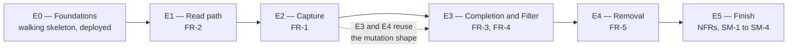

# Simple Action — Work Split

> How the build divides, and in what order. This is an **architectural** view of the work — the sequence is chosen so that each unit's hardest dependency already exists when it starts. It is not a substitute for `bmad-create-epics-and-stories`, which would produce proper stories with acceptance criteria; it is the input that skill should build from.

## Sequencing principle

Two rules drove the order, and both cut against the obvious one (build the features in FR order):

1. **Deploy on day one, not at the end.** The PRD's maintainability NFR — clone to running in five minutes, and a stated deploy path — is a *testable requirement*. Requirements verified last are requirements discovered broken last.
2. **The read path before the write path.** FR-1 looks like the natural starting point, but its hardest story (AD-16, merge-by-id) is a race *against an in-flight list load*. There has to be a load to race against before that story can be written or tested.

E3 and E4 are largely independent of each other once E2 has established the mutation shape, so they can run in parallel if more than one person or agent is working.

---

## E0 — Foundations

**Goal:** a deployed, empty application with every architectural seam in place. Nothing user-visible beyond a blank card.
**Why first:** every AD below assumes these modules exist. Building them per-feature is how the seams get skipped.

| # | Story | Governed by |
| --- | --- | --- |
| 0.1 | Scaffold Next.js 16 / React 19 / TypeScript 6; strict mode; lint rule forbidding `fetch` in components and Drizzle imports outside the repository | AD-1, AD-2 |
| 0.2 | Transcribe `DESIGN.md` frontmatter into the Tailwind v4 `@theme` block; load Poppins via `next/font` | AD-13 |
| 0.3 | Neon project and branches; Drizzle schema for `client_identity` and `todo`; first committed migration; `(owner_id, id DESC)` index | AD-14 |
| 0.4 | Repository module — the only Drizzle importer; every function `ownerId`-first | AD-2 |
| 0.5 | Shared contract module — Todo wire shape, error envelope, validation constants and predicate | AD-3, AD-10, AD-11 |
| 0.6 | Middleware identity issuance; identity resolution; token hashing | AD-7, AD-17 |
| 0.7 | App shell — QueryClientProvider, the two live regions, the error-slot provider | AD-8, AD-9, AD-12 |
| 0.8 | README and first Vercel deploy; **time the clone-to-running path and record it** | PRD §5 |

**Done when:** a stranger can clone, set one env var, and run it in under five minutes — and the same commit is live on Vercel.

---

## E1 — Read path (FR-2)

**Goal:** the list renders, in every state it can be in.

| # | Story | Governed by |
| --- | --- | --- |
| 1.1 | `GET /api/todos` + repository list, ordered `id DESC` | AD-5, AD-6 |
| 1.2 | `useTodos` query hook | AD-8 |
| 1.3 | Card, layout, sticky top block, scroll model, `todo-row-active` / `todo-row-completed` | `DESIGN.md` |
| 1.4 | Skeleton rows with identical geometry — verify zero layout shift | `EXPERIENCE.md` |
| 1.5 | All three empty states, with their exact strings | `EXPERIENCE.md` §Voice and Tone |
| 1.6 | Error banner, error slot with retry closure, load-failure path and its `Retry` | AD-9, AD-10 |
| 1.7 | Live-region announcer + the empty-state announcement | AD-12 |

**Note on 1.6:** the error slot is built here, once, with all four kinds already modelled — not grown a kind at a time across E2–E4. Growing it incrementally is how four inline error treatments appear instead of one region.

---

## E2 — Capture (FR-1)

**Goal:** adding a Todo, including the race the UX spec commits to.

| # | Story | Governed by |
| --- | --- | --- |
| 2.1 | `POST /api/todos` — client-supplied UUIDv7, format validation, idempotent on PK conflict, `409` on cross-owner conflict | AD-4 |
| 2.2 | Server-side validation via the shared predicate | AD-11 |
| 2.3 | Input component: Enter to submit, clear-and-retain-focus, 500-char hard stop, char counter at 450, whitespace no-op, pointer-only autofocus | AD-11 |
| 2.4 | **`useCreateTodo`: optimistic insert, no query cancellation, merge-by-id on list arrival** | **AD-16**, AD-8 |
| 2.5 | Add revert — remove the row, return the text to the input with the caret at the end, banner + `Retry` re-using the same id | AD-8, AD-9, AD-4 |

**2.4 is the hardest story in the build.** It is the one that will be got wrong by following TanStack Query's documented optimistic-update recipe, which starts by cancelling in-flight queries. Read AD-16 before starting it. Write the add-during-load test first.

---

## E3 — Completion and Filter (FR-3, FR-4)

| # | Story | Governed by |
| --- | --- | --- |
| 3.1 | `PATCH /api/todos/:id` — sets `completed`, idempotent, no toggle endpoint | AD-6 |
| 3.2 | `useSetCompleted` — optimistic, **per-entity rollback** | AD-8 |
| 3.3 | Filter tabs: three segments, counts derived locally, counts in the accessible name, zero network | AD-8 |
| 3.4 | Departure transition (~400ms hold, ~180ms collapse) and its reduced-motion path | Motion convention |
| 3.5 | Toggle revert, including returning a departed row to its original position | AD-8, AD-9 |

---

## E4 — Removal (FR-5)

| # | Story | Governed by |
| --- | --- | --- |
| 4.1 | `DELETE /api/todos/:id` — idempotent, owner-scoped | AD-6, AD-15 |
| 4.2 | Delete affordance, all three routes: swipe on touch, hover icon on pointer, **keyboard always** | `EXPERIENCE.md` |
| 4.3 | Confirmation dialog: focus trap, initial focus on Cancel, Escape, and the full focus-return rules | `EXPERIENCE.md` §Dialog |
| 4.4 | `useDeleteTodo` — optimistic removal, restore-in-place on failure | AD-8, AD-9 |
| 4.5 | First-run swipe nudge, once ever, with its `localStorage` flag rules | Nudge convention |

**4.2's keyboard route is not a fallback** — `EXPERIENCE.md` calls it the WCAG 2.2 AA floor. A hover-only or gesture-only affordance fails the requirement outright, so it is part of this story rather than deferred to E5.

---

## E5 — Finish

**Goal:** the NFRs and success metrics that no single feature story owns. This epic is where the PRD's actual thesis — *a deliberately small product can still feel finished* — is either true or not.

| # | Story | Validates |
| --- | --- | --- |
| 5.1 | Focus-not-obscured (WCAG 2.4.11): live-measured `scroll-padding-top` / `scroll-margin-top` against the sticky block | `EXPERIENCE.md` §Accessibility Floor |
| 5.2 | Playwright: UJ-1 through UJ-4 end to end | SM-1, SM-2 |
| 5.3 | Playwright with route interception: all four failure paths, plus the add-during-load race | SM-3 |
| 5.4 | Vitest: validation predicate, merge-by-id reconciliation, per-entity rollback under concurrent mutations | AD-8, AD-11, AD-16 |
| 5.5 | Responsive pass, one-handed phone check, and the 500-character wrap check at the smallest viewport | SM-4, `DESIGN.md` flagged tension |
| 5.6 | Contrast audit against `DESIGN.md`'s table — especially the 4.69:1 pair with no headroom | `DESIGN.md` |
| 5.7 | README re-verified end to end; deploy runbook | PRD §5 |

---

## What this split deliberately avoids

- **No "backend epic" then "frontend epic."** Each epic crosses the stack for one capability, so an endpoint and its consumer are written together and the contract in AD-3 is exercised immediately rather than agreed in the abstract.
- **No error-handling epic at the end.** Error states are acceptance criteria per SM-3, so each mutation's failure path ships inside its own story. The single error region is built once, in E1.
- **No accessibility epic at the end.** Keyboard routes, focus management and announcements sit in the stories that create the controls. Only 5.1's live measurement is deferred, because it can only be measured once the sticky block is final.
- **No polish epic.** There is nothing in `DESIGN.md` or `EXPERIENCE.md` labelled optional.

## Suggested next step

Run `bmad-create-epics-and-stories` against `ARCHITECTURE-SPINE.md` and this file to produce stories with acceptance criteria, then `bmad-sprint-planning`.
